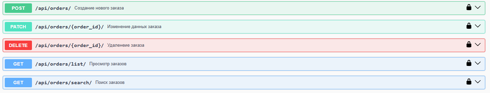

# Управление заказами в ресторане

## Описание
Этот проект представляет собой систему управления заказами в ресторане. Включает в себя функционал для создания, обновления, удаления и поиска заказов, а также отчет о выручке.

## Функциональность
- **Создание заказа**.
- **Редактирование заказа**.
- **Удаление заказа**.
- **Фильтрация заказов** по номеру стола и статусу.
- **Просмотр отчета о выручке**.

## Установка и настройка
### 1. Клонирование репозитория
```sh
git clone https://github.com/regxb/orders-management-system.git
cd orders-management-system
```

### 2. Создание `.env` файла
Создайте `.env` файл в корневой папке проекта и настройте его, пользуясь примером `.env_example`:
```sh
cp .env_example .env
```

### 3. Запуск в Docker
```sh
docker-compose up --build -d
```
Приложение будет доступно по адресу: [http://127.0.0.1:8000](http://127.0.0.1:8000)

### 5. Наполнение базы данных
```sh
docker-compose exec app poetry run python manage.py loaddata orders/fixtures/orders.json
```

### 6. Создание суперпользователя
```sh
docker-compose exec app poetry run python manage.py createsuperuser
```

## Тестирование
Для запуска тестов используй `pytest`:
```sh
docker-compose exec app poetry run pytest
```

## API Эндпоинты
Для работы с API доступны следующие интерфейсы документации:
- **Swagger UI**: [/api/docs/swagger/](http://127.0.0.1:8000/api/docs/swagger/)
- **Redoc**: [/api/docs/redoc/](http://127.0.0.1:8000/api/docs/redoc/)

